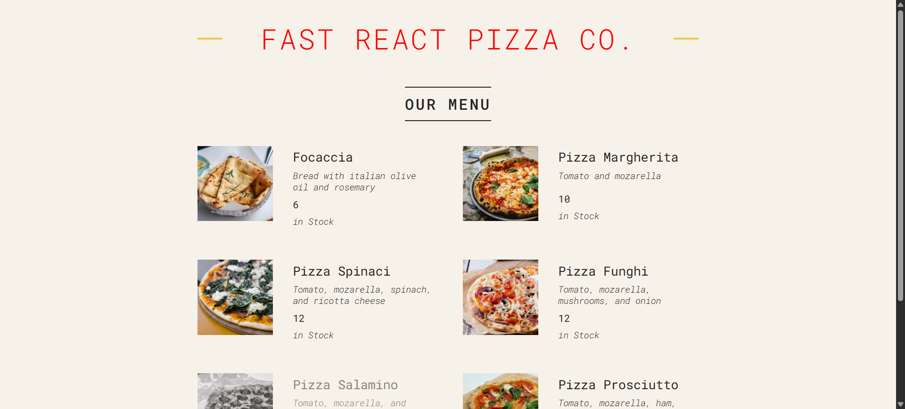

# 🍕 Pizza Menu

Welcome to the Pizza Menu project! This is a simple yet engaging web application built while learning React basics. The app allows users to browse through a variety of pizza options, view their details, and explore the world of delicious pizzas. It's a great way to practice React fundamentals while creating something fun and interactive.

## 📌 Features

- **Interactive UI**: Display various pizza options with details such as name, description, and price.
- **Responsive Design**: A mobile-friendly layout for easy navigation on all devices.
- **React Basics**: Learn and implement key React concepts like components, state, and props.

## 🚀 Tech Stack

- **React**: The core JavaScript library for building user interfaces.
- **HTML5** & **CSS3**: For structuring and styling the app.
- **JavaScript**: To add interactivity and logic to the app.

## 🔧 Getting Started

To get a local copy up and running, follow these simple steps:

### 1. Clone the repo
```bash
git clone https://github.com/rohitrao835589/Pizza-Menu.git
```

### 2. Install dependencies
```bash
cd Pizza-Menu
npm install
```

### 3. Run the application
```bash
npm start
```

Visit [http://localhost:3000](http://localhost:3000) to view the app in your browser.

## 🌟 Demo




## 💡 What I Learned

- The app helped me understand **React components**, **props**, and **state management**.
- I got hands-on experience with **handling user interactions** and **rendering dynamic content**.
- It was a great introduction to building responsive, interactive web applications.

## 📚 Future Improvements

- Add **pizza customization** options (like size, crust type).
- Integrate a **shopping cart** feature for users to add pizzas and proceed to checkout.
- Implement **API integration** to fetch dynamic pizza data from a backend.

## 🙋‍♂️ Contact

Feel free to reach out to me if you have any questions or suggestions!

- GitHub: [@rohitrao835589](https://github.com/rohitrao835589)
- LinkedIn: [Rohit Rao](https://www.linkedin.com/in/rohitrao835589)
```
